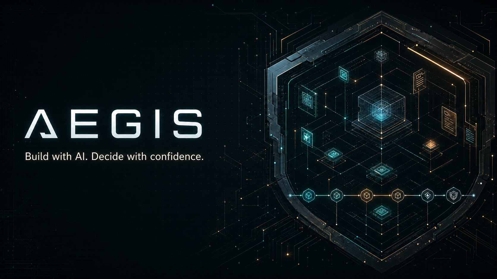

# Aegis



## Executive Overview

Aegis turns AI-assisted development into a disciplined, evidence-led workflow that still moves at practical speed. Unlike an unchecked prompt-to-code approach or a heavyweight one-size-fits-all process, it scales planning, verification, and human approval to the risk of the work. Leaders get clearer decisions, stronger release confidence, and a durable record of why the project is worth doing.

## Getting Started with Aegis

### A practical introduction

Aegis is a Codex skill that helps a person and their AI agents build software with more clarity, evidence, and control. It is for the moment when an idea needs to become a real project, not merely a convincing-looking pile of generated code.

AI agents can explore a codebase, propose a design, write code, run tests, and draft documentation very quickly. That speed is useful. It also means a weak assumption, a missing requirement, or an unsafe change can travel much farther before a human notices it. Aegis gives the work a shared path: agree on the outcome, understand the risk, make the plan inspectable, verify the result, and stop when a human decision matters.

Its purpose is simple: help you turn an idea into a safe, reviewable plan that an AI agent can act on with your explicit approval. Aegis keeps the human accountable for the decisions that belong to a human, such as what to build, what risk is acceptable, whether the evidence is good enough, and whether a result is ready to release.

### Why this matters for AI-assisted development

Software development has always needed a lifecycle: a way to move from a problem to a working result without losing the reasons, decisions, and checks along the way. AI does not remove that need. It makes the need more visible.

Without a shared process, an agent can produce a plausible solution before anyone has agreed on the actual problem, the limits of the work, or how success will be checked. The result may still compile. It may even look polished. That is not the same as being safe, maintainable, or fit for the job.

Aegis is designed to avoid two bad extremes:

- **Unchecked prompt-to-code:** fast at first, but easy to drift, hard to audit, and risky when the work matters.
- **One-size-fits-all process:** thorough on paper, but heavy enough to slow down small, reversible work.

Instead, Aegis scales its planning, testing, review, and human approval to the consequence of the change. A small, reversible task should not require a ceremony parade. Work involving security, personal data, production systems, money, or public release deserves stronger evidence and explicit stop points.

### What Aegis does and does not do

Aegis helps Codex organize the work, maintain a durable record, ask focused questions, and present decisions for human approval. It treats AI output as a useful first draft that must be reviewed and verified before it earns trust.

It does **not** replace engineering judgment, silently approve a decision, or automatically make software safe. It also does not install, deploy, commit, or enforce a workflow by itself. Those actions remain deliberate human-authorized steps.

### Your first success with Aegis

After a first Aegis-guided conversation, you should be able to point to a clear, shared answer to these questions:

1. What problem are we solving, and what is outside this effort?
2. How risky is the work, and what level of review does that call for?
3. What evidence will show that the result works and is safe enough?
4. What plan can an AI agent carry out only after the right human approval?

The next section explains the features that make that outcome possible.

### Features: how Aegis helps

Aegis is not a checklist you paste in at the end. It is a way to guide the work from the first conversation through verification and closeout. The amount of structure grows with the risk; its goal is useful evidence, not paperwork for paperwork's sake.

| Feature | What it means in everyday use | Why it helps |
| --- | --- | --- |
| Guided intake | Codex asks focused questions about the goal, the project location, the limits, and the initial risk. | It prevents an agent from sprinting toward an answer to the wrong problem. |
| Risk-scaled workflow | Aegis classifies work from `trivial` to `high/critical` before choosing the checks and approvals it needs. | A small, reversible change stays light; a high-consequence change gets the scrutiny it deserves. |
| Durable project memory | Aegis maintains clear project records: a README, journal, status view, specification, and build package when the work warrants them. | Decisions, evidence, risks, and open questions do not vanish into chat history. |
| An executable plan | Aegis turns agreed requirements into small, dependency-aware work items with an owner, inputs, expected result, verification, and entry and exit criteria. | An AI agent receives bounded work it can perform and a clear way to show that it finished correctly. |
| Human approval points | At consequential gates, Aegis stops and asks the human to approve, revise, or defer the work. | The agent never quietly turns a proposal into code, a commit, a deployment, or a release decision. |
| Independent review and verification | Aegis expects testing for every project and adds independent testing and security review when the risk or public exposure calls for them. | "The agent says it works" is not treated as proof. |
| Governed evidence and grounding | When an AI capability uses project or external material, Aegis requires a visible contract for what sources are allowed, which are authoritative, how current they must be, how they are cited, and what happens when evidence is weak or unsafe. | A plausible answer based on stale, wrong, unauthorized, or malicious material does not get mistaken for trustworthy context. |

#### 1. Start with the outcome and the risk

An Aegis conversation begins by establishing what is being changed, where the work belongs, what success looks like, and what is explicitly outside the effort. It then classifies the risk.

The classification is deliberately practical:

- **Trivial:** a small, isolated, reversible change. Record the scope, verify it, and close it out.
- **Low:** a bounded change with limited consequence. Keep a concise plan and obtain scope and acceptance approval.
- **Standard:** durable product work or a meaningful integration. Use a fuller plan, independent testing, security review, and explicit approval before execution.
- **High/critical:** work involving areas such as authentication, credentials, personal data, production infrastructure, payments, destructive migrations, or public release. Use the full gate model and stronger review evidence.

The point is not to assign a scary label. It is to match the cost of being wrong to the care taken before acting.

#### 2. Keep a project record that survives the conversation

Chat is useful for discovery, but it is a poor long-term source of truth. Aegis keeps durable Markdown records so the project can be understood by the next person, or by you next week, after three other emergencies have tried to eat your brain.

For non-trivial work, the core records are:

- **README:** the plain-language purpose, value, boundaries, and basic orientation.
- **Journal:** decisions, approvals, evidence, risks, and unresolved questions.
- **Status:** the current phase, approvals, blockers, verification state, material risks, and next action.
- **Specification:** the agreed outcome, requirements, boundaries, and acceptance evidence.
- **Build package:** the dependency-aware work plan that connects every requirement to delivery and verification.

These are not meant to replace a team's existing documentation. They provide the minimum evidence trail Aegis needs to help agents work safely and coherently.

#### 3. Turn requirements into bounded work

Before an AI agent begins product work, Aegis makes the plan concrete. Each work item identifies who or what role performs it, what it depends on, what it must produce, and how the result will be checked.

This matters because "build the feature" is not a plan. It hides unanswered questions about order, ownership, interfaces, tests, and acceptance. Aegis brings those questions into the open while they are still cheap to answer.

For larger work, Aegis separates the project-management and principal-engineering role from delivery roles such as coding, testing, security review, and documentation. The coordinating role keeps the plan and evidence coherent; the delivery roles produce and independently check the work.

#### 4. Keep important decisions human

AI can recommend a next step. It must not quietly decide that the project is ready to build, commit, deploy, or close.

At a required approval gate, Aegis presents the evidence, material risks, and a simple decision:

1. Approve
2. Revise
3. Stop/Defer

The human in the loop chooses. Aegis records that decision and does not move past the boundary without it. Lower-risk work uses fewer gates; high-consequence work uses the full set, including approval of scope, the build package, execution, acceptance, deployment, and closeout.

#### 5. Treat verification as evidence, not a victory lap

Aegis requires testing for every project, scaled to the kind of work. It also calls for pre-code and post-implementation reviews that consider security, maintainability, documentation, and, where relevant, observability and monitoring.

For standard, high/critical, and public-facing work, independent testing and security review are part of the process. This is not a claim that AI cannot help test or review. It is a recognition that the system that created a change should not be the only judge of that change.

#### 6. Govern the evidence an AI agent uses

Grounding is the practice of giving an AI agent documents, records, or other evidence to support its answer or action. Aegis treats that evidence as a governed dependency, not as a magical "search everything" button.

For grounded work, Aegis asks for an inspectable context contract. It identifies the purpose, authoritative sources, permitted scope, exclusions, freshness checks, citations or evidence receipts, permissions, and safe behavior when evidence is missing, stale, conflicting, or unauthorized.

It also keeps the original source separate from derived material such as indexes, embeddings, summaries, and model output. A search result can help find evidence; it does not become the authority just because it is convenient. Aegis also expects both positive tests (did the agent use the right source?) and negative tests (did it reject a wrong, excluded, stale, or malicious one?).

### Install Aegis in Codex

An Aegis installation is a skill folder named `aegis`. Keep the whole folder together: `SKILL.md`, the `agents` metadata folder, and the `references` folder all belong to the skill. Copying only `SKILL.md` leaves important guidance behind.

Start with the released package from the [Aegis repository](https://github.com/dotnetdavid/aegis). The skill itself is in `skill/aegis/`.

#### Choose where Aegis should apply

Codex supports both personal and repository-scoped skills. Neither is a "lite" version; choose based on who should use Aegis and where.

| If you want... | Put the complete `aegis` folder here | Result |
| --- | --- | --- |
| Aegis available whenever **you** use Codex | Your user skills folder: `~/.agents/skills/aegis` | Available across your local projects. |
| Aegis to travel with **one repository or team** | `<repository-root>/.agents/skills/aegis` | Available when Codex is started in that repository or one of its subfolders. |

`~` means your home folder. On Windows, use `%USERPROFILE%\.agents\skills\aegis`. On macOS and Linux, use `~/.agents/skills/aegis`.

#### Install the skill

1. Download or clone the [Aegis repository](https://github.com/dotnetdavid/aegis).
2. Find its `skill/aegis` folder.
3. Choose personal or repository scope from the table above.
4. Create the destination `skills` folder if it does not already exist.
5. Copy the complete `aegis` folder to that destination. The final path should be either `~/.agents/skills/aegis` or `<repository-root>/.agents/skills/aegis`.
6. Confirm that the installed folder contains `SKILL.md` and the `references` folder.
7. Start a new Codex session. Codex normally detects skill changes automatically; if Aegis does not appear in the skills list, restart Codex.

Do not place the folder inside another `aegis` folder by accident. The installed structure should look like this:

```text
.agents/
  skills/
    aegis/
      SKILL.md
      agents/
      references/
```

#### Verify that Codex can see Aegis

In a new Codex conversation, explicitly invoke it:

```text
$aegis Help me turn this idea into a safe, reviewable plan before any implementation begins.
```

You should see Aegis begin with focused questions about the outcome, project location, constraints, and initial risk. It should not leap directly into implementation. If the skill is not available, check the folder path and that `SKILL.md` is directly inside the `aegis` folder, then restart Codex.

#### Put Aegis to work

Use Aegis when you want AI-assisted development to be deliberate, inspectable, and proportionate to the risk. These prompts are good starting points:

```text
$aegis I want to add a customer-export feature. Help me define the scope and risk first. Do not change product files until I approve execution.
```

```text
$aegis Review this existing project before we ask any agents to change it. Identify the current source of truth, material risks, and the evidence we need for a safe plan.
```

```text
$aegis We want an AI feature that answers questions from internal documentation. Define the evidence boundaries, authoritative sources, permissions, freshness checks, and tests before proposing implementation.
```

You can also ask for Aegis by name in ordinary language. Explicitly writing `$aegis` is the clearest way to start the governed workflow.

#### A sensible first project

For a first run, choose something real but bounded: a small feature, a focused bug fix, or a planned integration that has a clear owner and a clear success condition. Avoid beginning with a production deployment or a broad rewrite. The goal is to experience the full loop, scope, risk, plan, approval, evidence, and closeout, without turning your first outing into a boss fight.

### Where to go next

Once Aegis is installed, use it at the start of a new project or before a material change to an existing one. Let the required evidence and approval points scale with the consequence of the work. The workflow is there to make important decisions visible, not to make a small change cosplay as a regulated space program.

For the current Codex skill model and supported skill locations, see OpenAI's [Build skills guide](https://learn.chatgpt.com/docs/build-skills).
